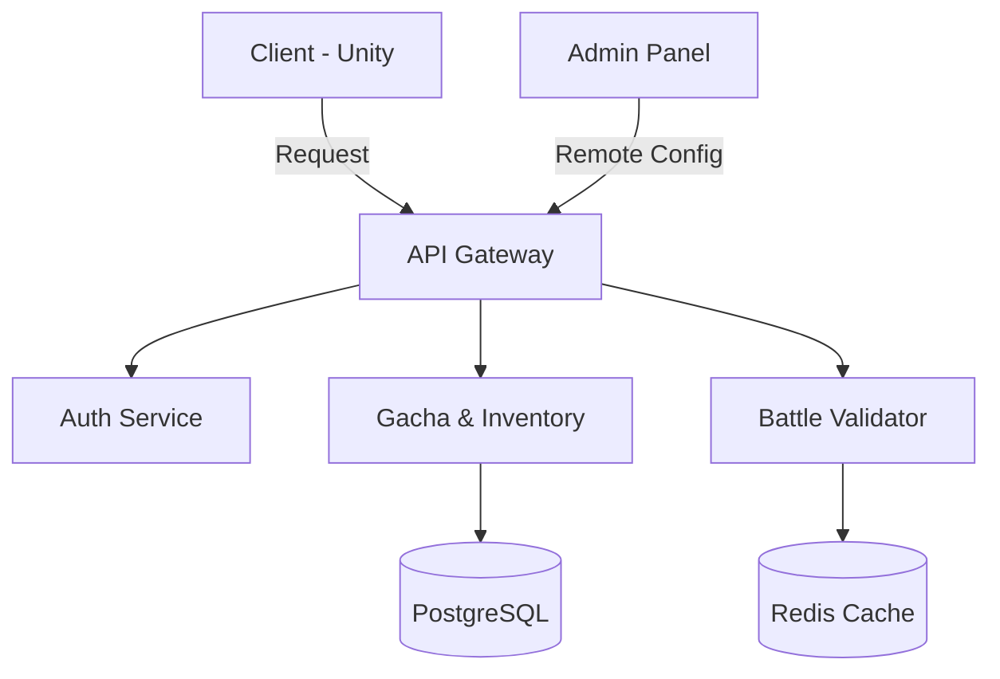

# 🎮 Анатомия Мобильных Рейд-RPG: Полный разбор механик

Современные рейд-игры (Squad-based RPG) — это сложные математические модели, замаскированные под героическое фэнтези. Ниже представлен пошаговый разбор того, как работают эти игры в 2024-2026 годах.

---

## 1. Мета-геймплей: Коллекционирование и Gacha

Центральный узел игры, вокруг которого строится монетизация и долгосрочный интерес.

### Система призыва (Summoning)

Использование «осколков» или «свитков» для получения случайного героя.

### Pity-система (Гарант)

Механика, гарантирующая выпадение легендарного героя после определенного количества неудачных попыток (например, на 80-й или 200-й призыв).

### Тиринг и Фракции

Герои делятся на стихии (Огонь, Вода, Воздух и т.д.).

**Синергия фракций:** Бонусы к характеристикам (HP, Атака), если в команде несколько бойцов из одного клана.

---

## 2. Глубокая прогрессия персонажа

Разработчики создают «слоеный пирог» из механик усиления, чтобы игрок всегда чувствовал микро-прогресс.

### А. Базовые параметры

| Параметр | Влияние на бой |
| :--- | :--- |
| ATK / DEF | Базовый урон и поглощение входящего урона. |
| SPD (Скорость) | Определяет, как часто и как быстро заполняется полоска хода героя. |
| C.RATE / C.DMG | Шанс критического удара и его множитель. |
| ACC / RES | Меткость (шанс наложить дебафф) против Сопротивления (шанс его избежать). |

### Б. Экипировка (Gears/Artifacts)

**Сеты:** Ношение 2/4 предметов одного типа дает уникальный бонус (кража жизни, игнорирование брони, доп. ход).

**Рандом статов:** Предметы имеют случайные дополнительные характеристики, что заставляет игрока фармить одно и то же подземелье месяцами в поисках «идеального ролла».

---

## 3. Боевая механика (Battle Core)

Пошаговая стратегия, где ключевым ресурсом является время и очередность.

### 1. Полоска хода (Turn Meter)

Бой идет не просто «я — ты», а на основе скорости. Быстрый герой может походить дважды, пока медленный босс копит энергию.

### 2. Активные и пассивные навыки

Обычно у героя 3 активных скилла (КД 3-5 ходов) и 1 пассивка.

### 3. Контроль толпы (CC)

Оглушение, заморозка, сон. В рейд-играх побеждает не тот, у кого больше урона, а тот, кто не дает противнику сделать ход.

---

## 4. Экономический цикл (Daily Loop)

Игра спроектирована так, чтобы встраиваться в ежедневную рутину пользователя.

- **Энергия (Stamina):** Валюта входа в бой. Ограничивает игровую сессию.
- **Авто-бои и Мульти-бои:** Возможность поставить телефон на стол, пока игра сама проходит 30 сражений подряд.
- **Дейлики:** Список задач, выполнение которых дает премиум-валюту (алмазы/кристаллы).

---

## 5. Эндгейм и Социальные механики

Когда кампания пройдена, фокус смещается на противостояние:

- **Клановые Боссы (CB):** Битвы, требующие колоссального урона. Награды выдаются в зависимости от вклада каждого игрока.
- **Арена (PvP / Tag Arena):** Сражения за место в лиге.
- **Башни испытаний:** 100+ этажей с нарастающей сложностью, которые обновляются раз в месяц.

---

## 6. Архитектура серверной части (Backend Architecture)

Создание архитектуры для мобильной рейд-игры — это задача на стыке высокой производительности (тысячи боев в секунду) и строгой безопасности (чтобы никто не «нарисовал» себе легендарного героя). Наилучшей архитектурой сегодня считается **Client-Authoritative Hybrid** с распределенным бэкендом.

### Шаг 1: Разделение на Микросервисы

Нельзя держать всё в одном коде. Если «упадет» чат, игроки должны иметь возможность продолжать бой.

- **Auth Service:** Вход через Google/Apple/Facebook.
- **Profile Service:** Хранение статов игрока, инвентаря и прогресса.
- **Gacha Service:** Изолированный рандомайзер (генератор случайных чисел), работающий строго на сервере.
- **Battle Service:** Самый сложный узел, проверяющий легитимность боя.

### Шаг 2: Модель данных (Схема БД)

Рейд-игры — это игры про состояния (State). Вам нужна комбинация SQL и NoSQL.

- **SQL (PostgreSQL):** Для транзакций, покупок и хранения редко меняющихся данных (список всех героев в игре).
- **NoSQL (Redis/MongoDB):** Для кеширования профилей игроков и таблиц лидеров (Leaderboards), где данные меняются каждую секунду.

### Шаг 3: Боевой движок (Deterministic Simulation)

Это «сердце» архитектуры. Чтобы избежать читерства, используется принцип детерминизма:

1. **Клиент (телефон)** отправляет на сервер только «сид» (seed) рандома и состав команды.
2. **Бой происходит на телефоне** (красивая графика).
3. **По завершении телефон отправляет серверу лог команд** (кто куда ударил).
4. **Сервер за миллисекунды «переигрывает» этот бой у себя без графики.** Если результаты совпали — награда выдается. Если нет — бан за читы.

### Шаг 4: Система обновлений (LiveOps)

Рейд-игры живут за счет еженедельного контента.

- **CDN (Content Delivery Network):** Игрок скачивает из Play Store 100 МБ, а остальные 2 ГБ моделей и текстур догружаются с серверов в зависимости от региона.
- **Remote Config:** Возможность менять баланс сил героев или шансы в Гаче без выпуска обновления в магазин.

### Шаг 5: Очереди сообщений и Масштабирование

Когда в игру заходит миллион человек (например, во время ивента), сервер может лечь.

- **Kafka / RabbitMQ:** Очереди для обработки событий (например, «Игрок А побил Босса»). Это позволяет серверу обрабатывать запросы постепенно, не создавая пиковых нагрузок на базу данных.

### Резюме архитектурного стека:

| Слой | Технология |
|---|---|
| Engine | Unity (C#) или Unreal Engine (C++) |
| Backend | Go (высокая скорость) или Node.js / Java |
| Database | PostgreSQL + Redis |
| Infrastructure | Docker + Kubernetes (K8s) для авто-масштабирования |

### Архитектурная схема

> Визуализировать эту схему можно в онлайн-инструментах типа [Mermaid.js](https://mermaid.live/) или [Draw.io](https://app.diagrams.net/).

---

> **Важное замечание:** Современные рейд-игры всё чаще уходят в сторону **Idle (афк-прогресса)**, позволяя героям фармить ресурсы, пока приложение закрыто. Это ответ на запрос аудитории, у которой нет времени на 4-часовой гринд.

---

## 📚 Дополнительные ресурсы

- [Raid: Shadow Legends Mechanics](https://plarium.com/en/raid-shadow-legends/)
- [Gacha System Analysis](https://www.gacha-analysis.com/)
- [Mobile Game Monetization](https://www.gamedesigning.org/learn/mobile-game-monetization/)
- [Game Server Architecture](https://gafferongames.com/post/what_every_programmer_needs_to_know_about_game_networking/)
- [Microservices for Games](https://www.amazon.com/Microservices-Games-Software-Architecture-Production/dp/1492048373)

---

## 📄 Лицензия

MIT License - Copyright (c) 2026 Bivex

## 📞 Контакты

- GitHub: https://github.com/bivex
- Email: support@b-b.top
